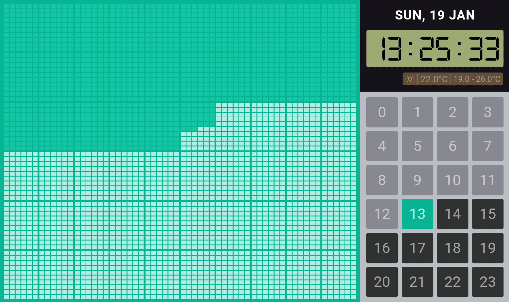
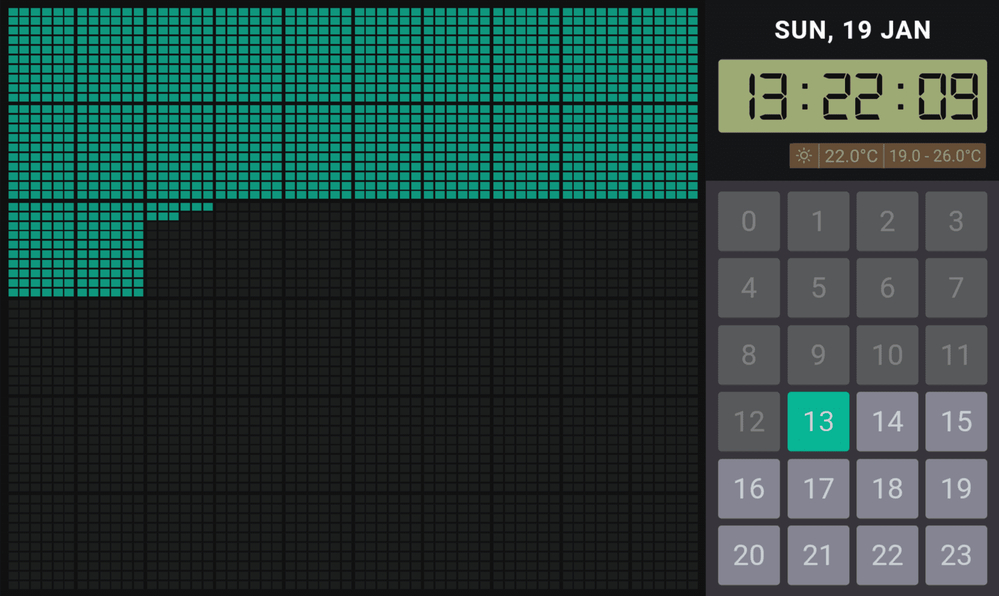

  <h1>Graph-Calculator Clock</h1>
  <h5>Time progress graph with hour indication in calculator-like UI! 🕗</h5>

  
<table>
  <tr>
    <th colspan="2">Clock Details</th>
  </tr>
  <tr>
    <td>Name</td>
    <td>Graph-Calculator Clock</td>
  </tr>
  <tr>
    <td>Description</td>
    <td>This clock face displays progress of each second of the current hour in a graph, and on the side with an hour-indicator in calculator UI</td>
  </tr>
  <tr>
    <td>UI</td>
    <td></td>
  </tr>
  <tr>
    <td>Type</td>
    <td>Digital</td>
  </tr>
  <tr>
    <td>Themes</td>
    <td>Light & Dark</td>
  </tr>
  <tr>
    <td>Author</td>
    <td>Praseetha KR (<a href="https://twitter.com/void_imagineer">@void_imagineer</a>)</td>
  </tr>
<table>
  

  <h3>Screenshots</h3>
  <h5>Light Theme</h5>
  

  <h5>Dark Theme</h5>
  

